# 🐱 Miau Finance Architecture

```
  ╱|、
 (˚ˎ 。7  
  |、˜〵          
  じしˍ,)ノ    "A well-designed system is like a cat —
               every part has a purpose, and it always lands on its feet."
```

## System Overview

Miau Finance is a modular, cloud-native financial analytics platform composed of **10 containerized services** across **6 layers**. The architecture spans **27 sovereign middleware boundaries**, **150+ REST endpoints**, **75+ terminal commands**, and **25+ external data providers** — all orchestrated through a cat-themed CRT terminal interface.

**Version:** v2.3.0 "Datavore Edition" · **Scale:** 10 services, 800+ tests, 27 phases, 1 cat

---

## System Diagram

```mermaid
graph TB
    subgraph "External Users"
        BROWSER[Browser<br/>localhost:5173]
        API_USER[API Client<br/>Python/JS/curl SDK]
    end

    subgraph "Frontend — Presentation Layer"
        TERM["🐱 Terminal UI<br/>React 18 · Vite · TypeScript<br/>934-line shell · 4657-line commands<br/>75+ terminal commands"]
        MAP["🌍 3D Globe<br/>MiauGlobe (WebGL globe.gl)<br/>WorldMap (Leaflet + MarkerCluster)<br/>Map2D (Canvas orthographic)"]
        DEV["🔧 Dev Console + Admin<br/>DeveloperConsole (356 lines)<br/>AdminConsole (351 lines)"]
    end

    subgraph "Backend — API Layer"
        FA["📡 FastAPI Server<br/>Python 3.12 · asyncpg · httpx<br/>490-line main.py · 150+ endpoints<br/>WebSocket: real-time prices<br/>Port 8000"]
        AUTH["🔐 Auth Subsystem<br/>JWT (HS256 + HybridPQC)<br/>SIWE (EIP-4361) · API Keys<br/>SSO (OAuth2/OIDC)<br/>Hardware Wallet · Encrypted Keychain"]
        MID["🛡️ Middleware Chain (27 layers)<br/>Rate Limit · CSP/HSTS · CSRF<br/>Audit Logging · Input Sanitization<br/>RBAC · Tier · Plugin Permissions<br/>PQC Crypto (Kyber/Dilithium/Falcon)"]
    end

    subgraph "Datavore — Data Source Layer"
        DS["💨 Unified Data Source Registry<br/>25+ providers — 8 no-key, 5 key-based<br/>Cache-aside pattern with Redis<br/>Circuit breaker + fallback chains<br/>Rate limit tracking per provider"]
        YF["Yahoo Finance · CoinGecko · FRED<br/>Finnhub · SecuritiesDB · TwelveData<br/>Alpha Vantage · HF Data · EIA · IMF<br/>BLS · Mobula · DumbStock · Frankfurter"]
    end

    subgraph "Analytics — Compute Layer"
        AI["🤖 AI Advisor<br/>GPT-4o-mini / Claude<br/>Streaming · NLQ · RAG<br/>Miau-1B local LLM"]
        VAL["🏦 IB Valuations<br/>DCF · WACC · Comps · LBO<br/>Sensitivity · Football Field<br/>Accretion/Dilution"]
        QUANT["⚛️ Quantum<br/>QUBO · QAOA · D-Wave<br/>Hybrid Quantum-Classical<br/>PQC (Kyber/Dilithium/Falcon)"]
        AGI["🧠 AGI Finance<br/>Hypothesis Generation<br/>Causal Inference · Sentient Portfolio<br/>Meta-Learning"]
        RUST["🦀 Rust PyO3 Engine<br/>Monte Carlo · Anomaly Detection<br/>Backtesting · Risk Calc"]
    end

    subgraph "Storage Layer"
        PG["🐘 PostgreSQL 16<br/>Relational + Ontology<br/>27 migrations · 829-line ORM<br/>Port 5432"]
        REDIS["⚡ Redis 7<br/>Rate Limiting · Caching<br/>Session Store<br/>Port 6379"]
        MINIO["💾 MinIO<br/>S3 Object Store<br/>Documents · Exports<br/>Ports 9000/9001"]
    end

    subgraph "DevOps & Monitoring"
        PROM["📊 Prometheus<br/>Metrics Collection<br/>Port 9090"]
        GRAF["📈 Grafana<br/>6 Dashboards<br/>Port 3000"]
        AF["⚡ Airflow<br/>DAG Scheduler<br/>Port 8080"]
        SUP["📊 Superset<br/>BI Dashboards<br/>Port 8088"]
        CUBE["📦 Cube.js<br/>Semantic Layer<br/>Port 4000"]
        DBT["🔧 dbt<br/>Data Transformations"]
        DOCKER["🐳 Docker<br/>10 Services · Compose<br/>Health Checks · Volumes"]
        K8S["☸️ Kubernetes<br/>HPA · PDB · TLS · Ingress"]
    end

    BROWSER --> TERM
    API_USER --> FA
    TERM --> FA
    MAP --> FA
    DEV --> FA

    FA --> MID
    MID --> AUTH
    FA --> DS
    DS --> YF

    FA --> AI
    FA --> VAL
    FA --> QUANT
    FA --> AGI
    FA --> RUST

    FA <--> PG
    FA --> REDIS
    FA --> MINIO

    PROM --> FA
    PROM --> PG
    PROM --> REDIS
    GRAF --> PROM
    CUBE --> PG
    SUP --> CUBE
    AF --> PG
    DBT --> PG
    DOCKER --> DOCKER
    K8S --> DOCKER

    style TERM fill:#0a1a14,stroke:#00ff88,color:#00ff88
    style FA fill:#1a3a2a,stroke:#00ff88,color:#00ff88
    style DS fill:#1a2a1a,stroke:#44cc66,color:#44cc66
    style PG fill:#1a1a3a,stroke:#6666ff,color:#6666ff
    style REDIS fill:#3a1a1a,stroke:#ff6666,color:#ff6666
    style AI fill:#2a1a3a,stroke:#cc88ff,color:#cc88ff
    style QUANT fill:#1a2a3a,stroke:#4488ff,color:#4488ff
```



---

## Section 1 — Frontend Stack

**Tech:** React 18 · Vite 6 · TypeScript · Tailwind CSS · Canvas API · WebGL

| Component | File | Lines | Role |
|-----------|------|-------|------|
| **Terminal Shell** | `Terminal.tsx` | 934 | Main CLI — command input, history (↑↓), TAB autocomplete, CRT effects, voice input, themes, i18n (8 languages), achievements, Catberg, CatCompanion |
| **Command Engine** | `lib/commands.ts` | 4,657 | 75+ commands across 20 categories — singleton parser + executor |
| **WorldMap** | `WorldMap.tsx` | 1,354 | Leaflet 3D globe — MarkerCluster, batched markers, continent shards, catboats/jets/ISS, company detail panel, weather overlay |
| **MiauGlobe** | `MiauGlobe.tsx` | — | WebGL globe via `globe.gl` — GPU-accelerated 3D with trade arcs, company points |
| **Map2D** | `Map2D.tsx` | 731 | Canvas orthographic globe — proper lat/lng projection, 3D shading, continent outlines, curved trade routes, ResizeObserver |
| **Heatmap** | `Heatmap.tsx` | — | Sector/correlation heatmap — 3 visualization modes |
| **DeveloperConsole** | `DeveloperConsole.tsx` | 356 | API key management, webhooks, usage stats, tier info |
| **AdminConsole** | `AdminConsole.tsx` | 351 | Team management, billing info, subscriptions, API usage |
| **Catberg** | `Catberg.tsx` | 335 | Cat-themed Bloomberg terminal — bull/bear/neutral commentary |
| **SocialDashboard** | `SocialDashboard.tsx` | — | Feed, leaderboard, sharing, follow system |
| **CorrelationMatrix** | `CorrelationMatrix.tsx` | — | Interactive correlation matrix |
| **BenchmarkComparison** | `benchmark.tsx` | — | Portfolio vs SPY overlay, alpha/beta/tracking error |

### CRT Terminal Aesthetics
```
• CRT scanlines: repeating-linear-gradient animation at 10s
• Phosphor bloom: contrast(1.05) brightness(1.02) filter
• Vignette overlay: radial-gradient darkening at screen edges
• Beam cursor: terminal-cursor-smooth CSS animation
• Dark theme: #06080f background, #00ff88 accent, #c8d6e5 text
• Reduced motion: prefers-reduced-motion disables all effects
• Green phosphor: #00e676 primary, #5a9a6a dim (4.7:1 contrast ratio)
```

---

## Section 2 — Backend API (FastAPI)

**Tech:** FastAPI · Python 3.12 · asyncpg · httpx · SQLAlchemy · Alembic

### App Structure
```
backend/
├── app/
│   ├── main.py                # FastAPI app (490 lines) — 24 API modules, 27 middleware
│   ├── api/                   # Route handlers
│   │   ├── analytics/         # market, optimizer, risk, signals, reports,
│   │   │                       monte_carlo, sentiment, factors, attribution,
│   │   │                       regime, pairs, earnings, ai_advisor, alternative,
│   │   │                       valuation, scenario, dividends, data_sources
│   │   ├── defi/              # wallet, protocols
│   │   └── *.py               # 24 standalone routers
│   ├── services/
│   │   ├── analytics/         # Business logic
│   │   ├── data/              # Unified data source layer (v3.0 Datavore)
│   │   ├── defi/              # WalletConnect, EVM, Solana
│   │   ├── hedgefund/         # RL agent, regime adaptive, position sizing
│   │   ├── plugin/            # spec, loader, hooks, sandbox, permissions
│   │   ├── quantum/           # QUBO, annealing, hybrid
│   │   └── scheduled/         # Billing cron, usage aggregator
│   ├── models/__init__.py     # SQLAlchemy ORM (829 lines, 30+ models)
│   ├── schemas/               # Pydantic schemas
│   ├── middleware/             # 27 security/ops middleware (2,775 lines total)
│   │   └── crypto/            # PQC: Kyber, Dilithium, Falcon, Hybrid
│   ├── config.py              # Pydantic Settings (224 lines)
│   ├── database.py            # async engine + session factory
│   └── static/                # admin.html, index.html, logviewer/
├── alembic/                   # 12 sequential migrations
├── agi/                       # AGI Finance core
├── rust_analytics/            # PyO3 Rust extension
└── tests/                     # Test suite (260+ tests)
```

### API Endpoint Inventory (150+)

| Domain | Count | Key Routes |
|--------|-------|------------|
| **Platform** | 3 | `/health`, `/api/v1`, `/dashboard` |
| **Auth** | 4 | `/auth/token`, `/auth/refresh`, `/security.txt` |
| **Market Data** | 13 | `/market/live`, `/market/historical/{t}`, `/market/sectors`, `/market/crypto`, `/market/forex`, `/market/movers`, `/market/indicators` |
| **Currencies** | 3 | `/currencies`, `/currencies/convert`, `/currencies/{code}` |
| **Global Markets** | 2 | `/markets/global`, `/markets/global/{exchange}` |
| **Ontology** | 8 | CRUD for types, properties, links, objects |
| **Instruments** | 5 | CRUD + market data + sectors/types listing |
| **Portfolios** | 8 | CRUD + positions + trades + share + export + currency |
| **Trades** | 2 | List + detail |
| **Search** | 1 | Full-text search |
| **Pipelines** | 3 | PnL calculation, pipeline management |
| **Analytics** | 6 | Summary, portfolio, PnL, scenarios, dividends, rolling risk |
| **News** | 3 | Market news, company news, batch |
| **Optimizer** | 4 | Max Sharpe, min variance, equal weight, performance |
| **Risk** | 5 | VaR, beta, stress test, greeks, comprehensive |
| **Signals** | 3 | Generate, multi-asset, backtest |
| **Fundamentals** | 6 | Overview, income, balance, cashflow, earnings, holders, filings, insider |
| **Economics** | 6 | Commodities, treasury, breadth, FRED, market overview |
| **Options** | 1 | Options chain with Greeks |
| **Monte Carlo** | 1 | Price path simulation |
| **Reports** | 3 | PDF/Excel/CSV portfolio export |
| **WebSocket** | 1 | Real-time price streaming |
| **AI Advisor** | 7 | Portfolio, market, risk, query, workflows (parse/create/list/delete/run) |
| **Valuation** | 7 | WACC, DCF, Comps, LBO, Sensitivity, Football Field, Accretion/Dilution |
| **ESG** | 3 | Ticker score, portfolio score, screening |
| **Carbon** | 2 | Ticker footprint, portfolio footprint |
| **Green Finance** | 4 | Energy, bonds, funds, overview |
| **Billing** | 6 | Subscription, checkout, portal, webhook, cancel, history |
| **Developer** | 4 | Dashboard, webhooks CRUD, usage stats, API keys |
| **API Keys** | 3 | Create, list, delete |
| **Webhooks** | 4 | Create, list, delete, test-ping |
| **Audit** | 2 | `/audit/logs`, `/audit/export?format=csv\|json` |
| **Plugins** | 5 | Marketplace, install, remove, detail, hooks |
| **DeFi/Wallet** | 8 | WalletConnect, EVM, Solana, balance, protocols |
| **Rebalance** | 4 | Drift detection, rebalance plan, target allocations |
| **Summary** | 1 | Daily portfolio summary |
| **Quantum** | 5 | Formulate QUBO, anneal, classical, hybrid, bruteforce |
| **AGI** | 2 | `/agi/hypotheses`, `/agi/status` |
| **CBDC** | 6 | Digital Euro, Yuan, Dollar, Yen, multi-CBDC portfolio |
| **PQC Security** | 8 | Keypair, encrypt, decrypt, sign, verify, JWT create/verify, hybrid |
| **Education** | 10 | Course CRUD, quiz, progress, certificates, XP, streaks |
| **GameFi** | 7 | Tokens, P2E, guilds, virtual land, valuation, yield, NFT |
| **Metaverse** | 5 | GDP, real estate, employment, arbitrage, diversification |
| **Catberg** | 1 | `/catberg/{function_code}` — 41 function codes |
| **Logs** | 2 | List, export |
| **Log Viewer** | mount | `/logs-viewer` — static log viewer frontend |

### Middleware Chain (27 layers, 2,775 lines)

Execution order as registered in `main.py`:

| # | Middleware | Lines | Purpose |
|---|-----------|-------|---------|
| 1 | **InputSanitizationMiddleware** | 97 | XSS/SQLi pattern detection, HTML strip, entity encoding, path blocking |
| 2 | **AuditLoggingMiddleware** | 209 | JSON structured request logging, UNAUTHORIZED alerts, request ID |
| 3 | **PrometheusMiddleware** | 79 | Request counters, duration histograms |
| 4 | **RequestLimitsMiddleware** | 82 | Body size, header size, Content-Type validation |
| 5 | **SecurityHeadersMiddleware** | 54 | CSP (14 directives), HSTS preload, COOP/COEP/CORP, X-Frame DENY, Permissions-Policy |
| 6 | **CSRFMiddleware** | 70 | Token-based CSRF, X-CSRF-Token header, GET/HEAD exemption |
| 7 | **RequestIDMiddleware** | — | X-Request-ID header for distributed tracing |
| 8 | **DataQualityMiddleware** | 70 | Data freshness validation, health scores |
| 9 | **TierMiddleware** | 149 | Subscription tier resolution (free/pro/enterprise), API key/webhook limits |
| 10 | **RateLimitMiddleware** | 308 | Redis sliding window + in-memory fallback, tier-aware throttling, 429 + Retry-After |
| 11 | **PQC (6 modules)** | 450 | Kyber KEM, Dilithium sigs, Falcon sigs, hybrid crypto, key management |
| 12 | **RBAC** | 81 | Role-based access (admin/user/readonly), `require_admin()` decorator |
| 13 | **PluginPermissions** | 197 | 16 scoped permissions, DB-backed approval/revocation |
| 14 | **PluginSandbox** | 199 | Restricted execution, memory/time limits, crash isolation |
| 15 | **SIWE** | 170 | EIP-4361 Sign-In With Ethereum |
| 16 | **SSO** | 234 | OAuth2/OIDC configuration, provider discovery, PKCE |
| 17 | **BrokerAuth** | 185 | OAuth for intl brokers, region-scoped credential encryption |
| 18 | **Keychain** | 121 | AES-256-GCM encrypted credential storage |
| 19 | **HardwareWallet** | 46 | Ledger/Trezor integration |
| 20 | **ApiKeyAuth** | 72 | Key prefix lookup, SHA256 hashing, expiration enforcement |
| 21 | **ApiVersion** | 95 | Semver header parsing, deprecation/sunset lifecycle |
| 22 | **Pagination** | 128 | Page/limit query params, cursor-based pagination |
| 23 | **RequestLogging** | 57 | Debug request/response logging per API key |
| 24 | **Metrics** | 79 | Prometheus metrics collection |
| 25 | **AllowedHosts** | — | Host header validation |

---

## Section 3 — Data Sources (Datavore v3.0)

### Unified Data Source Layer
```
backend/app/services/data/
├── base.py              # DataSource abstract class
├── registry.py          # Provider registry with auto-discovery
├── manager.py           # Lifecycle: init, health check, rate limit tracking
├── cache.py             # Redis cache-aside with smart invalidation
├── key_vault.py         # Encrypted API key storage (AES-256-GCM)
└── providers/           # 25+ data source implementations
```

### Provider Inventory (25+)
| Provider | Key Needed? | Rate Limit | Data |
|----------|------------|------------|------|
| **Yahoo Finance** | No | Rate-limited (429) | Live prices, history, fundamentals, news |
| **CoinGecko** | No (free tier) | 30 req/min | Crypto prices, market data |
| **FRED** | No (`demo` key) | 120 req/min | GDP, CPI, unemployment, Treasury yields |
| **Finnhub** | Yes | 60 req/min | Quotes, candles, SEC filings, insider, IPO, short interest |
| **SecuritiesDB** | No | 100 req/min | Piotroski F-Score, Altman Z, DCF, Fama-French |
| **StockPrice.dev** | No | Unlimited | Real-time stock prices (fallback) |
| **DumbStockAPI** | No | Unlimited | Global ticker search |
| **Twelve Data** | Yes | 800 req/day | 100k+ instruments, 50+ indicators, WebSocket |
| **Alpha Vantage** | Yes | 25 req/day | 48 technical indicators, sector perf, FX |
| **Frankfurter** | No | Unlimited | FX rates, 200+ currency pairs |
| **DeFiLlama** | No | Unlimited | DeFi TVL, protocols, chains |
| **Etherscan** | Yes | 5 req/sec | Ethereum gas, transactions |
| **CoinPaprika** | Yes | 25k req/month | Crypto tickers, exchanges, markets |
| **HF Data** | No | 100 req/min | 1-min OHLCV, 1,391 US equities, 23+ years |
| **EIA** | Yes | Free | Energy data: crude, natural gas, electricity |
| **IMF** | No | Unlimited | Global economic indicators |
| **BLS** | Yes | Free | CPI, employment, PPI |
| **Mobula** | No | 100 req/min | Cross-chain token data |
| **Blocknative** | No | 25 req/min | Gas estimation, mempool |

### Pattern: Unified Data Access
```python
# All providers follow the same pattern
async def get_data(ticker: str) -> dict:
    # 1. Check Redis cache (60s TTL for prices)
    cached = await cache.get(f"price:{ticker}")
    if cached: return cached

    # 2. Try primary provider
    try: data = await provider.get(ticker)
    except RateLimitError:
        # 3. Fallback to secondary
        data = await fallback_provider.get(ticker)

    # 4. Cache result
    await cache.set(f"price:{ticker}", data, ttl=60)
    return data
```

---

## Section 4 — Storage Layer

### PostgreSQL 16
- **Schema:** 27 Alembic migrations (sequential, linear chain)
- **ORM:** 829-line `models/__init__.py` — 30+ SQLAlchemy models
- **Key models:** users, subscriptions, instruments, portfolios, positions, trades, orders, PnL, risk_metrics, watchlists, alerts, api_keys, webhook_endpoints, usage_records, invoices, api_usage_log, currencies, esg_scores, carbon_footprints, social_activities, comments, follows, push_subscriptions, notification_history, ontology_types/properties/links/objects, paper_portfolios/trades, data_lineage, shared_portfolio_views, activity_logs, team_members, workspaces, counterparties

### Redis 7
- **Rate Limiting:** Redis sliding window per IP/user with in-memory fallback
- **Caching:** Cache-aside across 15+ external data sources, 60s TTL for prices
- **Auth:** `redis://:miau_redis@redis:6379/0`

### MinIO (S3-compatible)
- Reports, PDFs, CSV exports stored as objects
- Console at `localhost:9001` (miau_admin / miau_secret)

---

## Section 5 — Analytics & AI

### Portfolio Analytics
| Engine | Method | Implementation |
|--------|--------|---------------|
| **Markowitz** | Mean-variance optimization | `optimizer.py` |
| **Black-Litterman** | Investor views + equilibrium | `optimizer.py` |
| **Monte Carlo** | GBM price simulation | `rust_analytics/src/` (PyO3, 40x faster than Python) |
| **Risk Parity** | Equal risk contribution | `risk.py` |
| **VaR** | Historical, parametric, Monte Carlo | `risk.py` · 3 methods |
| **Options Greeks** | Black-Scholes delta/gamma/theta/vega/rho | `risk.py` |

### AI Advisor
- **Models:** GPT-4o-mini (OpenAI) / Claude 3-Haiku (Anthropic)
- **Capabilities:** Portfolio analysis, market overview, risk assessment, NLQ
- **Streaming:** Server-sent events for real-time token streaming
- **Miau-1B:** Local 1B-param LLM (Phase 22) — offline inference, llama.cpp
- **RAG:** 10M financial documents in vector DB (SEC filings, earnings calls)

### Investment Banking (Phase 12.5+)
- **DCF:** 5-year projections, Gordon Growth or exit multiple, sensitivity tables
- **WACC:** CAPM model with live beta, cost of debt
- **Comps:** 40+ sector peer groups, P/E, EV/EBITDA, P/B, P/S
- **LBO:** Debt waterfall, IRR, MOIC, exit multiple sensitivity
- **Football Field:** 5-method valuation range visualization
- **Accretion/Dilution:** Merger model with deal premium, synergies

### Quantum Computing (Phase 26)
- **QUBO:** Quadratic Unconstrained Binary Optimization for portfolio selection
- **D-Wave:** Quantum annealing via dimod SDK with simulated fallback
- **Hybrid:** 2-stage: QUBO pre-select → classical mean-variance fine-tune
- **PQC:** CRYSTALS-Kyber KEM + Dilithium/Falcon signatures (4 algorithms)

### AGI Finance (Phase 27)
- **Hypothesis Generator:** 6 pattern types, falsifiable hypotheses, confidence-ranked
- **Causal Inference:** Pearl do-calculus, instrumental variables, DiD
- **Sentient Portfolio:** Self-adapting, regime-aware, Kelly criterion

---

## Section 6 — Authentication & Security

### Auth Flows
```
┌─────────────┐     ┌──────────────┐     ┌──────────────┐
│  JWT Token   │     │   API Key    │     │  SIWE (Web3) │
│  HS256/Hybrid│     │  SHA256 Hash │     │ EIP-4361     │
│  Refresh OK  │     │ Key Prefix   │     │ Chain Bound  │
└──────┬───────┘     └──────┬───────┘     └──────┬───────┘
       │                    │                    │
       └────────────────────┼────────────────────┘
                            │
                   ┌────────▼────────┐
                   │  TierMiddleware │
                   │ free/pro/ent    │
                   └────────┬────────┘
                            │
                   ┌────────▼────────┐
                   │     RBAC +     │
                   │  Plugin Perms  │
                   └────────────────┘
```

### HTTP Security Headers (10+)
| Header | Value |
|--------|-------|
| `Content-Security-Policy` | 14 directives including `default-src 'none'`, `connect-src 'self' https://api.openai.com ...` |
| `Strict-Transport-Security` | `max-age=63072000; includeSubDomains; preload` |
| `X-Frame-Options` | `DENY` |
| `Cross-Origin-Opener-Policy` | `same-origin` |
| `Cross-Origin-Embedder-Policy` | `require-corp` |
| `Cross-Origin-Resource-Policy` | `same-origin` |
| `X-Permitted-Cross-Domain-Policies` | `none` |

### Security Docs
- `docs/SECURITY.md` (403 lines) — Architecture documentation
- `docs/SECURITY_AUDIT.md` (334 lines) — Latest audit (May 2026, score 8.7/10)
- `docs/SOC2.md` (204 lines) — Compliance checklist
- `security.txt` at `/.well-known/security.txt`

---

## Section 7 — Developer Platform

### SDKs
| Language | Location | Capabilities |
|----------|----------|-------------|
| **Python** | `sdk/python/` | Sync + async client, market/portfolio/trading/AI modules, error handling, pagination |
| **JavaScript** | `sdk/javascript/` | Fetch-based, convenience methods, TypeScript types |
| **curl** | `sdk/curl/` | 14 shell scripts, every API category, JWT + API key auth |

### Plugin System
```
app/services/plugin/
├── spec.py          # HookPoint enum (12 hooks), PluginBase, PluginMeta
├── loader.py        # Discover, validate, sandbox, lifecycle (188 lines)
├── hooks.py         # Dispatch, dispatch_chain, register/unregister
├── sandbox.py       # Restricted execution, memory/time limits
└── permissions.py   # 16 scopes, DB-backed approval/revocation
```

### Developer Docs (5 files, 2,656 lines)
- `docs/DEVELOPER.md` (506 lines) — Internal architecture & conventions
- `docs/DEVELOPER_API.md` (251 lines) — SDK quickstart + examples
- `docs/DEVELOPER_PORTAL.md` (370 lines) — Full onboarding
- `docs/PLUGIN_API.md` (207 lines) — Plugin development guide
- `docs/API.md` (3,820 lines) — Full 150+ endpoint reference

---

## Section 8 — Deployment & Infrastructure

### Docker Compose (10 Services)
```yaml
services:
  postgres:    postgres:16                    # Port 5432 → 5433
  redis:       redis:7-alpine                 # Port 6379
  minio:       minio/minio:latest             # Ports 9000, 9001
  backend:     miau-finance-backend           # Port 8000
  frontend:    miau-finance-frontend          # Port 5173
  cube:        cubejs/cube:latest             # Port 4000
  superset:    apache/superset:latest         # Port 8088
  airflow:     apache/airflow:2.9.0           # Port 8080
  prometheus:  prom/prometheus:latest         # Port 9090
  grafana:     grafana/grafana:latest         # Port 3000
```

### Kubernetes (Production)
- **HPA:** 2-10 replicas based on CPU/memory
- **PDB:** Max 1 unavailable during rollouts
- **TLS:** cert-manager with Let's Encrypt
- **Ingress:** NGINX-based routing

### Monitoring Stack
- **Prometheus:** Scrapes `/metrics` endpoint (JWT-protected)
- **Grafana Dashboards:** 6 panels — request latency, error rate, DB connections, Redis hits, cache hit rate, endpoint usage
- **Log Viewer:** `/logs-viewer` — real-time JSON log stream
- **System Monitor:** `/static/admin.html` — service health, cache stats, API metrics

---

## Section 9 — Phase Evolution

| Phase | Version | Theme | Key Milestone |
|-------|---------|-------|--------------|
| 1-6 | v0.1.0–v0.8.0 | Foundation | Terminal UX, market data, Rust engine, Docker |
| 7 | v0.9.0 | Intelligence | AI Advisor, workspaces, anomaly detection |
| 8 | v0.9.5 | Trading | Full OMS, paper trading, 6 strategies |
| 9 | v0.10.0 | Mobile | PWA, push notifications, responsive |
| 10 | v0.11.0 | Social | Sharing, feed, following, leaderboards |
| 11 | v0.12.0 | Monetization | Stripe, API keys, tier middleware |
| 12 | v0.13.0 | Enterprise | SSO, audit log, SOC2 |
| 13 | v0.14.0 | AI-Native | Voice, autocomplete, multi-step workflows |
| 14 | v0.15.0 | Global | 20 currencies, intl exchanges, 5 brokers |
| 15 | v0.16.0 | Developer | Python/JS/curl SDKs, plugin ecosystem |
| 16 | v0.17.0 | ESG | Carbon, green finance, screening |
| 17 | v1.0.0 | GA | Auto-rebalance, drift, export, summary |
| 18 | v1.1.0 | DeFi/Web3 | WalletConnect, EVM/Solana, NFTs |
| 19 | v1.2.0 | AI Hedge Fund | RL agent, ensemble, walk-forward |
| 20 | v1.3.0 | Miau Network | Strategy NFTs, P2P marketplace |
| 21 | v1.4.0 | DAO | Quadratic voting, ZK-KYC, fund contracts |
| 22 | v1.5.0 | Personal AI | Miau-1B, RAG, offline inference |
| 23 | v1.6.0 | Education | Terminal courses, quiz engine, XP |
| 24 | v1.7.0 | GameFi | Virtual land, P2E, metaverse GDP |
| 25 | v1.8.0 | CBDC | Digital Euro/Yuan/Dollar tracking |
| 26 | v1.9.0 | Quantum | QUBO, D-Wave, PQC (Kyber/Dilithium) |
| 27 | v2.0.0 | AGI | Hypothesis gen, causal inference, sentient |

### Code Growth
| Metric | v0.8.0 | v2.3.0 |
|--------|--------|--------|
| API Endpoints | 60 | 150+ |
| Terminal Commands | 25 | 75+ |
| Middleware Files | 0 | 27 (2,775 lines) |
| SDKs | 0 | 3 (Python, JS, curl) |
| Tests | 120 | 800+ |
| MiauPapers | 11 | 42 |
| Docker Services | 6 | 10 |
| External Data Providers | 5 | 25+ |

---

## Section 10 — Key Files Reference

| File | Lines | Purpose |
|------|-------|---------|
| `frontend/src/lib/commands.ts` | 4,657 | All 75+ terminal command implementations |
| `docs/API.md` | 3,820 | Full API reference (150+ endpoints) |
| `MIAUPAPERS.md` | 2,781 | 42 whitepapers covering all 27 phases |
| `frontend/src/components/WorldMap.tsx` | 1,354 | Leaflet 3D globe + controls |
| `docs/COMMANDS.md` | 1,451 | Command reference |
| `frontend/src/components/Terminal.tsx` | 934 | Main terminal shell |
| `backend/app/models/__init__.py` | 829 | 30+ SQLAlchemy ORM models |
| `frontend/src/components/Map2D.tsx` | 731 | Canvas 2D orthographic globe |
| `docs/DEVELOPER.md` | 506 | Internal architecture guide |
| `backend/app/main.py` | 490 | FastAPI app, 24 routers, 27 middleware |
| `docs/ARCHITECTURE.md` | this file | System architecture |
| `docs/DEVELOPER_PORTAL.md` | 370 | Developer onboarding |
| `backend/app/services/analytics/valuation.py` | 332 | IB valuations (DCF/WACC/Comps/LBO) |
| `docs/DEVELOPER_API.md` | 251 | SDK quickstart |
| `docs/PLUGIN_API.md` | 207 | Plugin development guide |
| `docs/CONTRIBUTING.md` | 289 | Contribution guide |
| `frontend/src/lib/autocomplete.ts` | — | TAB autocomplete engine |
| `backend/app/middleware/rate_limit.py` | 308 | Redis sliding window rate limiter |
| `backend/app/middleware/audit_logging.py` | 209 | JSON structured audit logs |
| `backend/app/middleware/tier.py` | 149 | Subscription tier enforcement |

---

## Quick Reference

| What | Where |
|------|-------|
| **Terminal UI** | `http://localhost:5173` |
| **API Swagger** | `http://localhost:8000/docs` |
| **Services Dashboard** | `http://localhost:8000/dashboard` |
| **System Monitor** | `http://localhost:8000/static/admin.html` |
| **Log Viewer** | `http://localhost:8000/logs-viewer` |
| **Grafana** | `http://localhost:3000` (admin/admin) |
| **Security Audit** | `docs/SECURITY_AUDIT.md` (score: 8.7/10) |
| **Full API Docs** | `docs/API.md` (3,820 lines) |
| **Command Reference** | `docs/COMMANDS.md` (1,451 lines) |
| **Source Code** | `github.com/LuZziD/cat-finance-analytics-shell-miau` |

---

*Miau Finance v2.3.0 — 10 services, 27 middleware layers, 150+ endpoints, 75+ commands, 25+ data providers, 1 cat.*
*Built with 💚, questionable financial decisions, and cat hair.*
*The cat has reviewed this architecture document. The cat approves. The treat jar is at 53%.*
